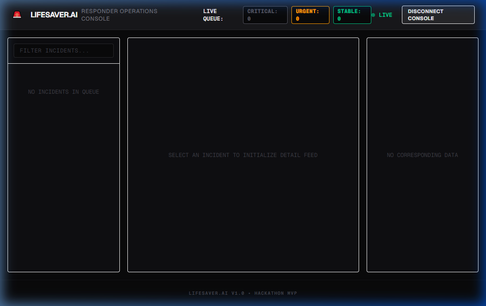
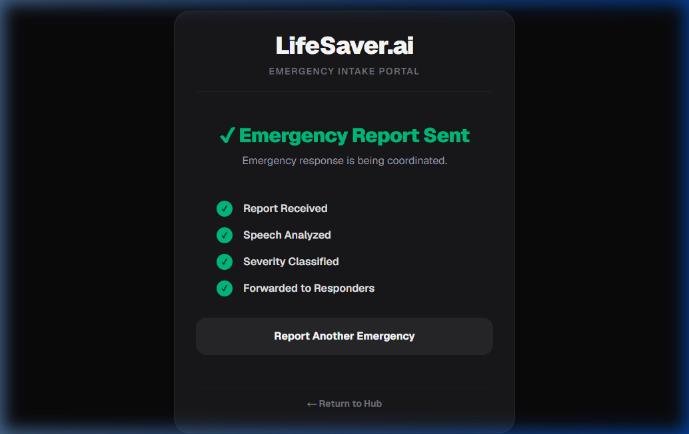
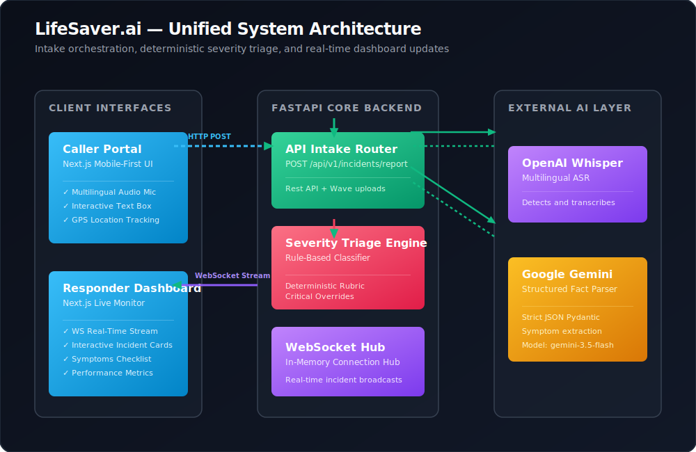
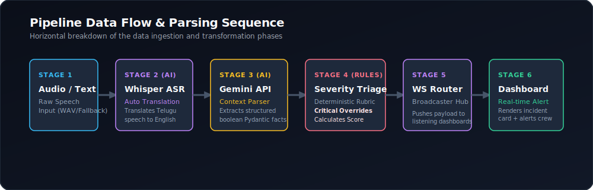
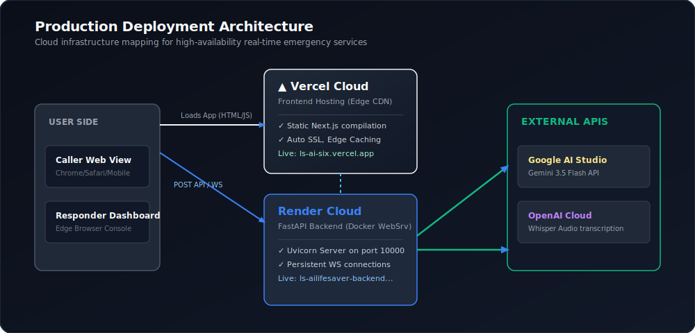
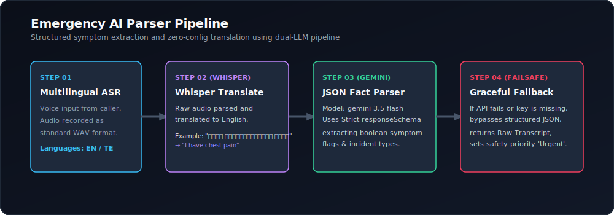
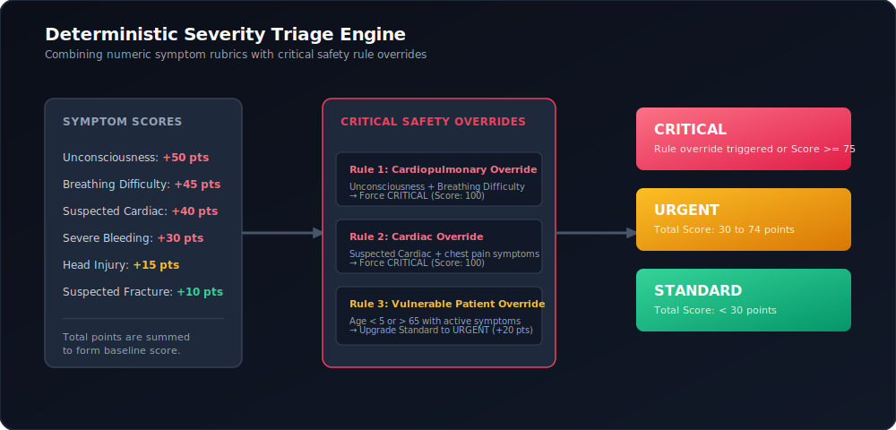
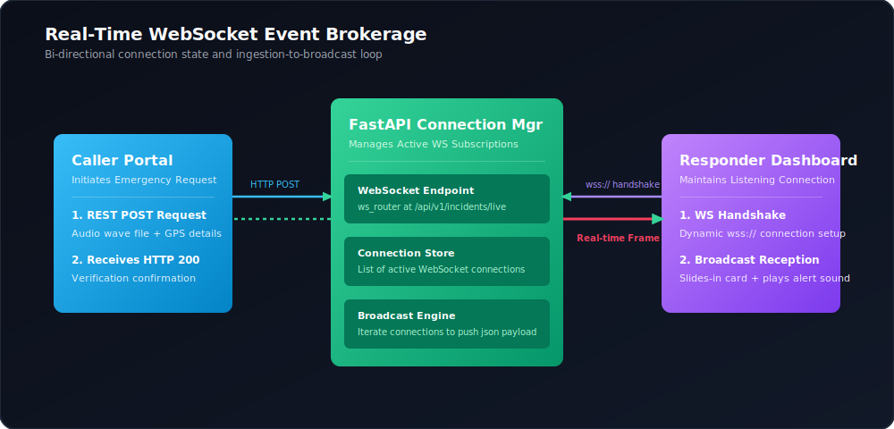

# 🚑 LifeSaver.ai (LS.ai)
### *Intelligent Emergency Intake. Deterministic Severity Triage. Saving Lives when Seconds Count.*

**LifeSaver.ai is an AI-powered emergency intelligence platform that transforms unstructured emergency reports into structured, prioritized incident cards, enabling responders to understand situations faster and coordinate more effectively.**

[](https://ls-ai-six.vercel.app)
[](https://ls-ailifesaver-backend.onrender.com/health)
[](https://ls-ailifesaver-backend.onrender.com/docs)
[](./LICENSE)

---

## 🎬 Live Production Links

* **Live Caller Portal:** [https://ls-ai-six.vercel.app/caller](https://ls-ai-six.vercel.app/caller)
* **Live Responder Dashboard:** [https://ls-ai-six.vercel.app/dashboard](https://ls-ai-six.vercel.app/dashboard)
* **API Documentation (Swagger):** [https://ls-ailifesaver-backend.onrender.com/docs](https://ls-ailifesaver-backend.onrender.com/docs)
* **Backend Health Check:** [https://ls-ailifesaver-backend.onrender.com/health](https://ls-ailifesaver-backend.onrender.com/health)
* **Deployment Details:** No installation required. Accessible from any modern web browser. Frontend and backend are publicly deployed.

---

## 💡 Why We Built This (The Tribute)

**LifeSaver.ai (LS.ai)** was created with a deep personal purpose. The name **LS** represents **Lokesh** and **Sasi**, my parents. Inspired by family experiences, this project aims to eliminate communication bottlenecks during the critical first few minutes of a medical crisis. While the inspiration is personal, the mission is universal—to make emergency communication faster, clearer, and more reliable for everyone.

---

## 🚨 The Problem & Bottlenecks

In emergency response, every second determines a patient's survival. Yet, modern dispatch infrastructure (like 112 in India) remains burdened by antiquated procedures:

1. **Intake Latency:** Callers are panicked, incoherent, or speak regional dialects. Dispatchers must manually translate, analyze, and type descriptions, wasting vital minutes.
2. **Triage Errors (Up to 30%):** Manual classification under high cognitive stress leads to incorrect severity levels, misrouting critical cases (like cardiac arrests) behind standard calls.
3. **Language Barriers:** Diverse populations face delays while operators transfer calls to bilingual coordinators, stalling immediate care.

---

## 🛠️ The Solution: How LifeSaver.ai Works

LifeSaver.ai is a **modern API-first intake wrapper** designed to sit in front of legacy dispatch databases, bypassing intake bottlenecks through automated translation, structured symptom extraction, and rule-based severity calculation.

```
Panicked Caller (Speak Telugu/EN) 
      ↓ (Gemini Multimodal Audio API (ASR & Auto-Translation))
English Transcript 
      ↓ (Gemini Structured Context Extraction)
Structured Symptoms Checklist (JSON) 
      ↓ (Python Severity Engine & Overrides)
Live Responder Dashboard (Alert chimes + Real-Time Card)
```

## 📦 Key Product Features

* **🎙️ Zero-Config Multilingual Ingestion:** The caller speaks in their native language (such as Telugu). The pipeline transcribes and auto-translates the audio into English (validated multilingual voice input using English and Telugu during testing).
* **🧠 Structured AI Context Parsing:**Google's `gemini-3.5-flash` model extracts precise symptom checklists using a strict JSON response schema matching our Pydantic data model.
* **🛡️ Deterministic Severity Classifier:** We decouple AI translation from medical classification. A custom Python rules engine maps symptom weights and applies critical overrides (e.g., Unconsciousness + Breathing issues = Critical, Score 100), ensuring triage decisions are 100% reproducible and explainable.
* **⚡ Live WebSocket Stream:** Transcripts and computed severity models are pushed to the Responder Dashboard via WebSockets (latency &lt; 50 ms after backend processing).
* **🔌 Graceful Degradation / Failsafe:** If mic permissions are denied or external AI APIs timeout, the Caller Portal seamlessly falls back to text manual entry and Raw Transcript mode, ensuring intake never crashes.

---

## 📊 Live System Status & Telemetry

Our real-time production verification confirms the following speed metrics:
* **Text Incident Pipeline:** **~1.1 seconds** (Text → Dashboard)
* **Voice Incident Pipeline:** **~5.6 seconds** (Speech → ASR → AI Parsing → Dashboard)
* **WebSocket Broadcast:** **&lt; 50 ms** after backend processing

---

## 🖼️ Live Application Screenshots

### 🚑 Professional Responder Dashboard
Features real-time slide-in incident cards, live timeline events, GPS tracking source tags, latency metrics, and an active symptom verification checklist.



### 📱 Caller Portal Ingestion Success
The clean, high-performance caller screen showing instant response validation and connection confirmation.



---

## 📐 System Diagrams & Flowcharts

### 1. System Architecture
A decoupled high-performance ASGI-Next.js network flow.


### 2. Pipeline Data Flow
How data is transformed from unstructured caller speech into structured coordinate alerts.


### 3. Deployment Architecture
Static frontend edge hosting via Vercel paired with a Dockerized FastAPI backend on Render.


### 4. Emergency AI Parser Pipeline
The unified AI parser structure (Gemini Multimodal Audio API + Gemini JSON parsing) with active validation schemas and fallback loops.


### 5. Severity Engine Logic Rubric
How symptom scoring lists are mapped to final severity outputs.


### 6. WebSocket Live Event Flow
The socket handshake and real-time push broadcast stream.


---

## 🎛️ Tech Stack

* **Frontend:** Next.js (App Router), TypeScript, Tailwind CSS, Vanilla CSS
* **Backend:** FastAPI (Python 3.12), Uvicorn ASGI Server
* **AI ASR:** Google Gemini Multimodal Audio API (Transcription & Auto-Translation)
* **AI Context Parser:** Google Gemini 3.5 Flash API (Structured JSON Schema generation)
* **Realtime Protocol:** WebSocket Router (`/api/v1/incidents/live`)
* **State Management:** In-memory queue cache (handles last 20 active incidents for live display)

---

## 📂 Repository Directory Structure

```text
d:\LS.ai
├── backend
│   ├── app
│   │   ├── api
│   │   │   ├── endpoints   # Router endpoints (incidents, WS connections)
│   │   │   └── router.py   # Mount point for endpoints
│   │   ├── core            # Configuration settings and global variables
│   │   ├── schemas         # Pydantic schemas (symptoms, facts, incidents)
│   │   └── services        # AI Services (Audio ASR Service, Gemini JSON parser)
│   ├── tests               # Unit tests (pytest suites for Severity Engine)
│   ├── requirements.txt    # Python package dependencies
│   └── Dockerfile          # Production backend Docker image
├── frontend
│   ├── app
│   │   ├── caller          # Next.js mobile caller portal page
│   │   ├── dashboard       # Next.js dispatcher console panel page
│   │   └── page.tsx        # Unified landing page
│   └── package.json        # NPM dependencies
├── docs
│   ├── assets              # High-quality SVG diagrams and screenshots
│   ├── pitch_guide.md      # 2-minute, 3-minute, and 5-minute presentation scripts
│   └── judge_qa.md         # Defensible responses to judge questions
├── LICENSE                 # MIT License file
└── README.md               # Main repository showcase documentation
```

---

## ⚙️ Local Development Setup

### 1. Prerequisites
* Python 3.10+
* Node.js 18+

### 2. Environment Variables Configuration

Create a `.env` file in the `backend/` directory:
```env
GEMINI_API_KEY=your_gemini_api_key_here
GEMINI_MODEL=gemini-3.5-flash
OPENAI_API_KEY=your_openai_api_key_here # Optional fallback transcription key
CORS_ORIGINS=http://localhost:3000,http://127.0.0.1:3000
```

Create a `.env.local` file in the `frontend/` directory:
```env
NEXT_PUBLIC_API_URL=http://127.0.0.1:8000
```

### 3. Running the Backend
From the root directory:
```bash
cd backend
python -m venv venv

# Windows PowerShell:
.\venv\Scripts\Activate
# macOS/Linux:
source venv/bin/activate

pip install -r requirements.txt
uvicorn app.main:app --host 127.0.0.1 --port 8000 --reload
```

### 4. Running the Frontend
From the root directory in a new terminal tab:
```bash
cd frontend
npm install
npm run dev
```
Open [http://localhost:3000/caller](http://localhost:3000/caller) for the Caller Portal, and [http://localhost:3000/dashboard](http://localhost:3000/dashboard) to view the Dispatch Dashboard.

---

## 🔮 Future Roadmap

1. **Fully Offline Operation:** Compile local on-device ASR models (like Whisper.cpp or Gemini Nano) and a quantized local LLM (like Llama-3-8B-Instruct via Llama.cpp) to run directly on the dispatcher's local edge server, allowing triage to continue during total internet blackouts.
2. **IoT Distress Ingestion:** Sync directly with smartwatch health sensors (sudden drop in heart rate) and vehicle impact sensors to automatically trigger silent emergency dispatches.
3. **Telemetry Dashboard Enhancements:** Connect responder maps to live traffic datasets (like Google Maps API) to compute optimal route times for ambulance dispatch.

---

## 👥 Team
* **Krishnachakri** — Solo Developer & Release Engineer

---

## 📄 License
This project is licensed under the **MIT License** - see the [LICENSE](./LICENSE) file for details.
